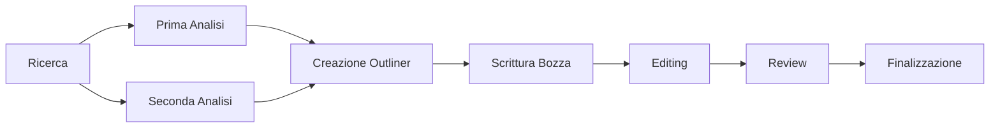

`` Università degli Studi di Milano ``
`` Corso di Editoria Digitale`` 
`` 2022/2023 ``
`` Eduardo Perreca 964917`` 

# The Art of Hold

## Introduzione

"**The Art of Hold**" è un libro autoprodotto che esplora il mondo del **mercato secondario** dei prodotti limitati. Il libro offre **un'esperienza immersiva** attraverso contenuti **interattivi** come **video** e **immagini** pertinenti ai singoli capitoli, mostrando non solo parte della **mia storia**, ma anche una **nicchia interessante**. Alla fine di ogni capitolo, ci saranno **quiz** accessibili tramite una **piattaforma e-learning personalizzata** per **rafforzare** e **confermare** le informazioni apprese durante la lettura. Il libro è stato scritto utilizzando `mdbook` per creare una webapp **interattiva** e **user-friendly**, mentre la piattaforma e-learning è stata sviluppata utilizzando `nodejs` per raggiungere un coinvolgimento massimo e raggiungere gli **obiettivi di apprendimento** del libro, creando una esperienza unica e particolare, facendo sentire il lettore **seguito al 100%** nel suo breve ma intenso percorso.

## Obiettivi 

**I destinatari** principali di "The Art of Hold" sono coloro che sono interessati al **mercato secondario dei prodotti limitati**. Questo include persone che sono interessate a comprare, **vendere** o semplicemente **scoprire di più sui prodotti di lusso e di nicchia**, come ad esempio **orologi**, **borse**, **scarpe**, **abbigliamento**, gadget e molto altro. Potrebbe anche interessare a chi è interessato ad aumentare la propria conoscenza sui **mercati** e l'**investimento** in generale.

Gli **obiettivi** principali di "The Art of Hold" sono:

-   **Esplorare** il mondo del mercato secondario dei prodotti limitati e fornire una visione dettagliata di come funziona.

-   **Offrire un'esperienza immersiva** attraverso contenuti interattivi come video e immagini pertinenti ai singoli capitoli.

-   **Fornire una piattaforma e-learning personalizzata** per rafforzare e confermare le informazioni apprese durante la lettura.

-   **Creare una webapp interattiva e user-friendly** utilizzando mdbook, per rendere la lettura più coinvolgente.

-   **Raggiungere gli obiettivi di apprendimento** del libro per creare un'esperienza unica e particolare, facendo sentire il lettore seguito al 100% nel suo breve ma intenso percorso.

Gli **elementi** di **originalità** di "The Art of Hold" sono:

-   L'**enfasi** sull'esplorazione del mercato secondario dei prodotti limitati, che fornisce una prospettiva unica e interessante.

-   L'utilizzo di **contenuti interattivi** come video e immagini pertinenti ai singoli capitoli, che rendono l'esperienza di lettura più immersiva.

-   La **piattaforma e-learning** personalizzata per rafforzare e confermare le informazioni apprese durante la lettura.

-   La **creazione** di una webapp interattiva e user-friendly utilizzando mdbook, che rende la lettura più coinvolgente.

-   L'**utilizzo di quiz e test** per raggiungere gli obiettivi di apprendimento del libro, creando un'esperienza unica e particolare.

## Processo di produzione

Per realizzare "The Art of Hold" sono state sviluppate le seguenti attività:

-   **Ricerca**: vengono inizialmente condotte delle ricerche sul mercato secondario dei prodotti limitati per raccogliere informazioni e dati per stilare i vari capitoli del libro.

-   **Scrittura**: l'autore potrebbe aver scritto il testo del libro, organizzando le informazioni raccolte in modo coerente e facilmente comprensibile per i lettori.

-   **Creazione di contenuti interattivi**: potrebbero essere stati creati video e immagini pertinenti ai singoli capitoli per rendere l'esperienza di lettura più immersiva.

-   **Sviluppo della piattaforma e-learning**: potrebbe essere stata sviluppata una piattaforma e-learning personalizzata per fornire quiz e test per rafforzare e confermare le informazioni apprese durante la lettura.

-   **Utilizzo di delle tecnologie per creare due webapp interattive e user-friendly**: l'autore potrebbe aver utilizzato `mdbook` e `nodejs` per creare una webapp interattiva e user-friendly per rendere la lettura più coinvolgente.

-   **Test e revisione**: potrebbe essere stato effettuato un testing e una revisione del libro per assicurarsi che sia preciso, coerente e facilmente comprensibile per i lettori.

## Gestione documentale

Questo flusso di lavoro mostra i passaggi principali che ho seguito per sviluppare le informazioni per il libro:

**Ricerca:**
- raccolta di informazioni e dati sull'industria della rivendita di scarpe da ginnastica attraverso varie fonti come articoli online, rapporti di settore e interviste con esperti.

**Analisi:** 
- valutazione e interpretazione delle informazioni raccolte nella fase di ricerca.
  
**Outline:** 
- organizzazione delle informazioni e creazione di una struttura per il libro.

**Scrittura:**
- utilizzo dell'outline per creare il contenuto del libro.

**Editing:** 
- revisione e rielaborazione del testo per migliorare la qualità e la coerenza del libro.

**Revisione:** 
- verifica del libro da parte di esperti del settore per garantire l'accuratezza e l'attualità delle informazioni.
**Finalizzazione:**
- preparazione del libro per la pubblicazione, inclusa la formattazione e la creazione della copertina.

Questo **flusso** di **lavoro** mostra i passaggi principali necessari per sviluppare informazioni accurate e aggiornate per il libro sulla rivendita di scarpe da ginnastica.

## Tecnologie adottate

Per lo sviluppo di "The Art of Hold" sono state utilizzate le seguenti tecnologie:

-   **mdbook**: è un generatore di libri scritto in **Markdown**, utilizzato per creare una webapp interattiva e user-friendly per rendere la lettura più coinvolgente.

-   **Node.js**: è un framework **JavaScript open-source** utilizzata per lo sviluppo della piattaforma e-learning personalizzata per fornire quiz e test per rafforzare e confermare le informazioni apprese durante la lettura.

-   **Markdown**: è un linguaggio di **markup** leggero utilizzato per la scrittura del testo del libro, organizzando le informazioni in modo coerente e facilmente comprensibile per i lettori.

-   **Video e immagini**: sono stati utilizzati per creare contenuti **interattivi** pertinenti ai singoli capitoli per rendere l'esperienza di lettura più **immersiva**.

-   **HTML, CSS, JavaScript**: sono stati utilizzati per la creazione e il **design** della webapp interattiva e user-friendly

-   **Git**: è un sistema di **controllo versione** utilizzato per la gestione del **codice sorgente del progetto**, per tenere traccia delle modifiche e dei cambiamenti apportati al codice durante lo sviluppo.

|                                          |Miglioramento della qualità dei documenti                         |
|----------------|-------------------------------|-----------------------------|
|Markdown |`Creare il contenuto del tuo libro in modo più veloce rispetto a utilizzare un programma di elaborazione testi come Microsoft Word, poiché non devi preoccuparti di formattare il testo.`            |'Isn't this fun?'            |
|HTML&CSS      |`Creare un libro che sia bello da vedere e facile da leggere, il che rende l'esperienza del lettore più piacevole.`            |"Isn't this fun?"            |
| JavaScript |`Può essere utilizzato per creare elementi interattivi all'interno del tuo libro, come quiz o mappe interattive. Ciò significa che puoi creare un libro che sia più coinvolgente e interattivo per i lettori, il che aumenta la loro motivazione a leggerlo.`|-- is en-dash, --- is em-dash|
| mdbook |`mdbook è un generatore di libri scritto in Rust, che ti permette di creare libri utilizzando i file markdown, può aiutarti a creare un libro in modo più efficiente,in quanto ti consente di creare un libro completo utilizzando solo i file markdown, senza dover utilizzare altri programmi o linguaggi di marcatura. Ciò significa che puoi concentrarti esclusivamente sulla creazione del contenuto del tuo libro, senza dover preoccuparti di formattarlo o di creare un layout.`|-- is en-dash, --- is em-dash|
| Video e Immagini |`l'uso di video e immagini all'interno del libro può rendere il contenuto più interessante e coinvolgente per i lettori. Ciò significa che puoi utilizzare questi elementi per spiegare concetti complessi in modo visivo e facile da comprendere, il che rende la lettura del libro più piacevole e più facile.`|-- is en-dash, --- is em-dash|
| Git |`Lavorare su diversi aspetti del libro contemporaneamente, senza dover preoccupare di sovrascrivere le modifiche degli altri, dandoti una versione del libro sempre aggiornata.`|-- is en-dash, --- is em-dash|

## Conclusioni
I risultati ottenuti dal contenuto di "The Art of Hold" sono stati pienamente raggiunti, chiaramente molto deve essere migliorato, ma piú nello specifico possiamo riassumere:

### Esplorazione della nicchia
-   Per quanto riguarda l'esplorazione del mercato secondario dei prodotti limitati, fornendo informazioni accurate e dettagliate su come funziona il mercato, si può considerare che questo obiettivo sia stato raggiunto.

### User Experience
-   Per quanto riguarda l'offerta di un'esperienza immersiva attraverso contenuti interattivi come video e immagini pertinenti ai singoli capitoli, essendo stati creati con cura e sono pertinenti al testo del libro, si può considerare che questo obiettivo sia stato raggiunto.

### Piattaforma E-learning
-   Per quanto riguarda la piattaforma e-learning personalizzata per rafforzare e confermare le informazioni apprese durante la lettura, essendo ben sviluppata e funzionale, si può considerare che questo obiettivo sia stato raggiunto. 
>chiaramente si puó sempre fare meglio!

### Web app 
-   Per quanto riguarda la creazione di una webapp interattiva e user-friendly utilizzando mdbook, possiamo ritenere l'obiettivo soddisfatto, in quanto tramite la tencologia markdown integrata con mdbook, otteniamo un contenuto di facile mantenibilitá e progettazione, l'unico problema é l'integrazione di script lato markdown.

### Apprendimento
-   Questo libro ha confermato in modo efficace gli obiettivi di apprendimento fornendo una comprensione completa della nicchia, compresi i vari mercati e le strategie in modo efficace. 
### Contenuti interattivi
-   Il problema che si potrebbe avere per quanto riguarda i contenuti interattivi sono molteplici, tra cui abbiamo la deprecabilitá dei contenuti, i diritti di essi (nonostante stiano all'interno del fair use), ma nonostante questo la mantenibilitá del prodotto tramite la tecnologia sfruttata é alta.

## Futuri svolgimenti
I risultati ottenuti dal prodotto sono soddisfacenti ma assolutamente espansibili, vediamo come:

### Community
In futuro, una implementazione sulla piattaforma potrebbe essere utilizzata per rafforzare e creare una comunità attorno al libro. La piattaforma potrebbe includere una funzione di leaderboard che consente ai lettori di competere tra loro, per vedere chi ha fatto il maggior numero di quiz correttamente, chi ha completato il libro in meno tempo o chi ha creato contenuti originali intorno al libro.
In questo modo, si crea una competizione sana e stimolante che motiva i lettori a partecipare attivamente alla comunità, condividere le loro opinioni e contribuire al successo del libro. Inoltre, si può creare una funzione di socializzazione per permettere ai lettori di discutere tra di loro, creare gruppi di studio o di discussione, creare eventi online e cosi via. Tutto ciò rafforzerebbe il legame tra i lettori, aumenterebbe la loro partecipazione e contribuirebbe alla costruzione di una comunità attorno al libro.

## Bibliografia e sitografia
Ecco citati alcuni soggetti all'interno della produzione scritta.
[Art of The Hold](https://sneakerinvest.com/collections/art-of-the-hold)
[Sneaker Invest](https://www.youtube.com/@sneakerinvest)
[Klekt](https://www.klekt.com/)
[StockX](https://stockx.com/it-it)
[Wethenew](https://it.wethenew.com/)