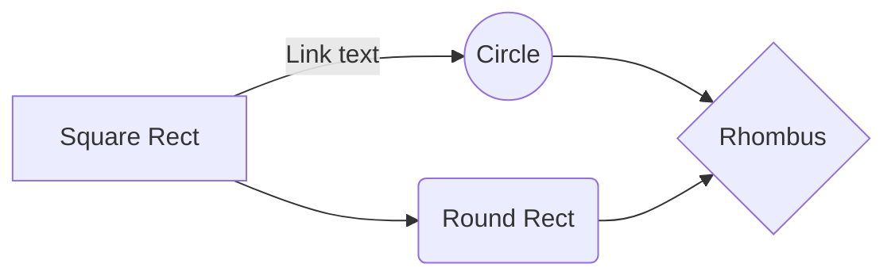

`` Università degli Studi di Milano ``
`` Corso di Editoria Digitale`` 
`` 2022/2023 ``
`` Eduardo Perreca 964917`` 

# The Art of Hold

## Introduzione

"**The Art of Hold**" è un libro autoprodotto che esplora il mondo del **mercato secondario** dei prodotti limitati. Il libro offre **un'esperienza immersiva** attraverso contenuti **interattivi** come **video** e **immagini** pertinenti ai singoli capitoli, mostrando non solo parte della **mia storia**, ma anche una **nicchia interessante**. Alla fine di ogni capitolo, ci saranno **quiz** accessibili tramite una **piattaforma e-learning personalizzata** per **rafforzare** e **confermare** le informazioni apprese durante la lettura. Il libro è stato scritto utilizzando `mdbook` per creare una webapp **interattiva** e **user-friendly**, mentre la piattaforma e-learning è stata sviluppata utilizzando `nodejs` per raggiungere un coinvolgimento massimo e raggiungere gli **obiettivi di apprendimento** del libro, creando una esperienza unica e particolare, facendo sentire il lettore **seguito al 100%** nel suo breve ma intenso percorso.

## Obiettivi 

**I destinatari** principali di "The Art of Hold" sono coloro che sono interessati al mercato secondario dei prodotti limitati. Questo include persone che sono interessate a comprare, vendere o semplicemente scoprire di più sui prodotti di lusso e di nicchia, come ad esempio orologi, borse, scarpe, abbigliamento, gadget e molto altro. Potrebbe anche interessare a chi è interessato ad aumentare la propria conoscenza sui mercati e l'investimento in generale.

Gli **obiettivi** principali di "The Art of Hold" sono:

-   **Esplorare** il mondo del mercato secondario dei prodotti limitati e fornire una visione dettagliata di come funziona.

-   **Offrire un'esperienza immersiva** attraverso contenuti interattivi come video e immagini pertinenti ai singoli capitoli.

-   **Fornire una piattaforma e-learning personalizzata** per rafforzare e confermare le informazioni apprese durante la lettura.

-   **Creare una webapp interattiva e user-friendly** utilizzando mdbook, per rendere la lettura più coinvolgente.

-   **Raggiungere gli obiettivi di apprendimento** del libro per creare un'esperienza unica e particolare, facendo sentire il lettore seguito al 100% nel suo breve ma intenso percorso.

Gli **elementi** di **originalità** di "The Art of Hold" sono:

-   L'**enfasi** sull'esplorazione del mercato secondario dei prodotti limitati, che fornisce una prospettiva unica e interessante.

-   L'utilizzo di **contenuti interattivi** come video e immagini pertinenti ai singoli capitoli, che rendono l'esperienza di lettura più immersiva.

-   La **piattaforma e-learning** personalizzata per rafforzare e confermare le informazioni apprese durante la lettura.

-   La **creazione** di una webapp interattiva e user-friendly utilizzando mdbook, che rende la lettura più coinvolgente.

-   L'**utilizzo di quiz e test** per raggiungere gli obiettivi di apprendimento del libro, creando un'esperienza unica e particolare.

## Processo di produzione

Per realizzare "The Art of Hold" sono state sviluppate le seguenti attività:

-   **Ricerca**: l'autore potrebbe aver condotto ricerche sul mercato secondario dei prodotti limitati per raccogliere informazioni e dati per il libro.

-   **Scrittura**: l'autore potrebbe aver scritto il testo del libro, organizzando le informazioni raccolte in modo coerente e facilmente comprensibile per i lettori.

-   **Creazione di contenuti interattivi**: potrebbero essere stati creati video e immagini pertinenti ai singoli capitoli per rendere l'esperienza di lettura più immersiva.

-   **Sviluppo della piattaforma e-learning**: potrebbe essere stata sviluppata una piattaforma e-learning personalizzata per fornire quiz e test per rafforzare e confermare le informazioni apprese durante la lettura.

-   **Utilizzo di delle tecnologie per creare due webapp interattive e user-friendly**: l'autore potrebbe aver utilizzato `mdbook` e `nodejs` per creare una webapp interattiva e user-friendly per rendere la lettura più coinvolgente.

-   **Test e revisione**: potrebbe essere stato effettuato un testing e una revisione del libro per assicurarsi che sia preciso, coerente e facilmente comprensibile per i lettori.

## Gestione documentale

Descrivere il *flusso di gestione documentale* definito per il progetto. Ad esempio, la raccolta delle fonti, la revisione dei contenuti, la trasformazione dei formati, la strutturazione dei contenuti, la definizione dello stile grafico.
> Il flusso può essere descritto utilizzando BPMN, lezione 5, slide 9. In alternativa, se si preferisce restare su un formato di puro testo è possibile usare il linguaggio Mermaid, supportato da alcuni editor Markdown. 

## Tecnologie adottate

Per lo sviluppo di "The Art of Hold" sono state utilizzate le seguenti tecnologie:

-   **mdbook**: è un generatore di libri scritto in **Markdown**, utilizzato per creare una webapp interattiva e user-friendly per rendere la lettura più coinvolgente.

-   **Node.js**: è un framework **JavaScript open-source** utilizzata per lo sviluppo della piattaforma e-learning personalizzata per fornire quiz e test per rafforzare e confermare le informazioni apprese durante la lettura.

-   **Markdown**: è un linguaggio di **markup** leggero utilizzato per la scrittura del testo del libro, organizzando le informazioni in modo coerente e facilmente comprensibile per i lettori.

-   **Video e immagini**: sono stati utilizzati per creare contenuti **interattivi** pertinenti ai singoli capitoli per rendere l'esperienza di lettura più **immersiva**.

-   **HTML, CSS, JavaScript**: sono stati utilizzati per la creazione e il **design** della webapp interattiva e user-friendly

-   **Git**: è un sistema di **controllo versione** utilizzato per la gestione del **codice sorgente del progetto**, per tenere traccia delle modifiche e dei cambiamenti apportati al codice durante lo sviluppo.

|                |Riduzione dei tempi di gestione                          |Miglioramento della qualità dei documenti                         |
|----------------|-------------------------------|-----------------------------|
|Markdown |`'Isn't this fun?'`            |'Isn't this fun?'            |
|XSLT       |`"Isn't this fun?"`            |"Isn't this fun?"            |
|ePud         |`-- is en-dash, --- is em-dash`|-- is en-dash, --- is em-dash|

## Conclusioni

I risultati ottenuti verificando se gli obiettivi di "The Art of Hold" sono stati pienamente raggiunti dipenderanno dalla qualità del libro e dalla sua efficacia nel raggiungere gli obiettivi prefissati.

Per quanto riguarda l'esplorazione del mercato secondario dei prodotti limitati, se il libro fornisce informazioni accurate e dettagliate su come funziona il mercato, si può considerare che questo obiettivo sia stato raggiunto.

Per quanto riguarda l'offerta di un'esperienza immersiva attraverso contenuti interattivi come video e immagini pertinenti ai singoli capitoli, se questi contenuti sono stati creati con cura e sono pertinenti al testo del libro, si può considerare che questo obiettivo sia stato raggiunto.

Per quanto riguarda la piattaforma e-learning personalizzata per rafforzare e confermare le informazioni apprese durante la lettura, se la piattaforma è ben sviluppata e funzionale, si può considerare che questo obiettivo sia stato raggiunto.

Per quanto riguarda la creazione di una webapp interattiva e user-friendly utilizzando mdbook, se la webapp è ben progettata e facile da usare, si può considerare che questo obiettivo sia stato raggiunto.

Per quanto riguarda il raggiungimento degli obiettivi di apprendimento del libro, per creare un'esperienza unica e particolare e fare sentire il lettore seguito al 100% nel suo breve ma intenso percorso, questo dipende dall'efficacia del libro nell'educare e fornire un'esperienza formativa completa.

In ogni caso, si potrebbero aver limitazioni sui contenuti interattivi, sulla qualità dei quiz e test, sull'usabilità e la navigabilità della webapp, sull'accuratezza e la completezza delle informazioni fornite, sull'efficacia nell'educare e formare il lettore.

## Bibliografia e sitografia

Elencare i riferimenti bibliografici e risorse online che hanno maggiormente contribuito alla realizzazione del progetto.